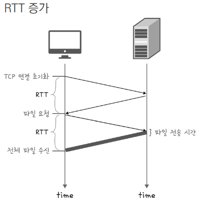
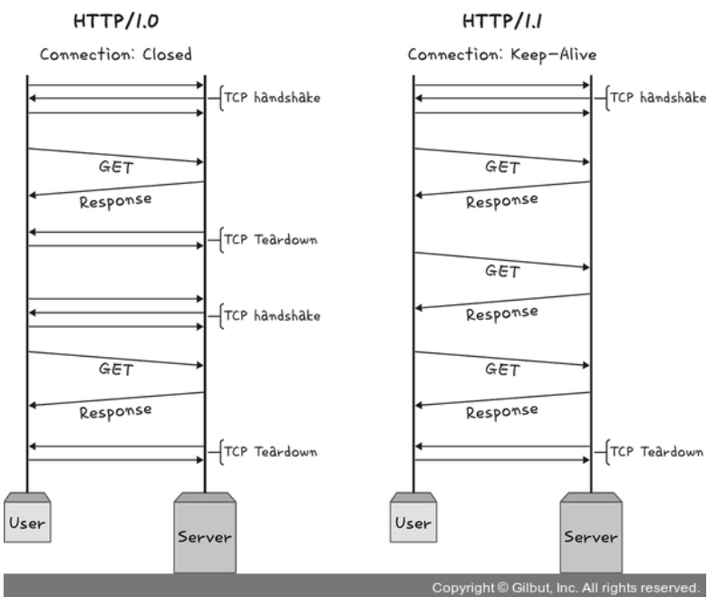
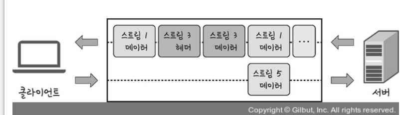
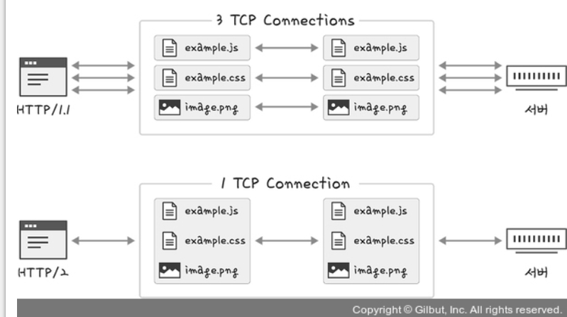

# 2.5 HTTP 프로토콜

## HTTP 개요

* HTTP는 전송 계층 위에 위치한 **애플리케이션 계층 프로토콜**로 웹 서비스 통신에 사용된다.
* HTTP는 **HTTP/1.0 → HTTP/1.1 → HTTP/2 → HTTP/3**로 발전해왔다.

---

## HTTP/1.0

* 기본적으로 **하나의 연결당 하나의 요청**을 처리하는 구조이다.
* 파일 요청마다 **TCP 3-way handshake**를 반복하여 연결을 새로 열어야 하므로 **RTT 증가** 문제가 있다.

> **RTT(Round Trip Time)**: 패킷이 목적지에 도달하고 출발지로 돌아오기까지 걸리는 시간

### RTT 감소를 위한 방법들

* **이미지 스플리팅**: 여러 이미지를 하나의 스프라이트 이미지로 병합 후, CSS로 나누어 표시
* **코드 압축**: 개행 문자, 공백 제거하여 코드 용량 감소
* **이미지 Base64 인코딩**: 이미지를 문자열로 변환하여 HTML에 직접 삽입 (HTTP 요청 절감, 용량 37% 증가 단점 있음)

---

## HTTP/1.1

* **Keep-Alive**를 통해 TCP 연결을 재사용할 수 있어 요청마다 핸드셰이크가 필요하지 않음
* **Keep-Alive**는 HTTP/1.0에도 있었으나, 1.1부터 표준화되어 기본 사용

### 단점

* 다수의 리소스를 포함한 문서 요청 시 **요청 개수에 비례해 대기 시간 증가**
* **HOL(Head of Line) Blocking** 현상 발생 가능: 큐에서 첫 번째 요청이 지연되면 전체 지연
* **무거운 헤더 구조**: 쿠키 등 많은 메타데이터 포함, 압축되지 않음

---

## HTTP/2

HTTP/2는 **SPDY**에서 파생되어 지연 시간 감소 및 성능 향상된 버전이다.

### 주요 특징

* **멀티플렉싱(Multiplexing)**: 하나의 연결에서 여러 스트림을 병렬로 전송

    * 하나의 스트림 문제는 해당 스트림에만 영향, 나머지에는 영향 없음

* **헤더 압축(HPACK)**: 허프만 코딩 기반 압축 알고리즘으로 헤더 크기 감소
* **서버 푸시(Server Push)**: 클라이언트 요청 없이 서버가 리소스를 미리 전송 가능
* **요청 우선순위 지원**

> **스트림(stream)**: 시간이 흐름에 따라 생성되는 연속적인 데이터 흐름

### 허프만 코딩이란?

* 문자 출현 빈도 기반으로 **빈도 높은 문자 → 짧은 비트 / 낮은 문자 → 긴 비트**로 구성
* 전체 데이터의 표현 비트 수 최소화

---

## SSL/TLS

* **SSL/TLS**는 전송 계층에서 **보안을 제공하는 프로토콜**
* **클라이언트 ↔ 서버 간 암호화 통신**으로 중간자 공격 방지

### 특징

* **보안 세션**: SSL/TLS 핸드셰이크로 생성되며, 통신 중 세션 상태 공유
* **암호화/인증/해시 알고리즘** 조합 사용
* \*\*공인 인증 기관(CA)\*\*을 통해 인증서 발급 (ex. Amazon)

---

## HTTPS 구축 방식

1. **인증서 구매 후 직접 서버에 적용**
2. **로드밸런서에서 HTTPS 처리 후 내부 통신은 HTTP**
3. **CDN(콘텐츠 전송 네트워크)를 통한 HTTPS 제공**

---

## HTTP/3

* **TCP 기반이었던 HTTP/2**와 달리, HTTP/3는 **UDP 기반의 QUIC 프로토콜 위**에서 작동
* **3-way handshake 없이** 초기 연결 설정 가능 (지연 시간 감소)
* **멀티플렉싱 지원** 및 HOL Blocking 문제 제거

### QUIC 특징

* **1-RTT 연결 설정**: 최초 연결 시 단 1RTT로 완료
* **순방향 오류 수정(FEC)**: 패킷 손상 시 수신 측에서 자체 복구 가능
* **낮은 패킷 손실률**: 무선 등 불안정한 네트워크 환경에서 강력함
