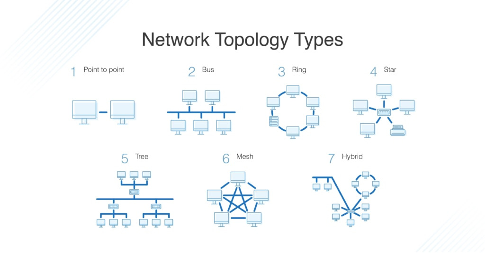

# 2.1 네트워크의 기초

---

## 2.1.1 처리량과 지연 시간

### 처리량 (Throughput)
- 링크를 통해 단위 시간당 전달되는 데이터 양
- 단위: bps (bits per second)
- 영향을 주는 요소:
    - 사용자 접속 수 증가로 인한 트래픽
    - 네트워크 장치 간 대역폭
    - 네트워크 에러
    - 장치의 하드웨어 사양

### 대역폭 (Bandwidth)
- 주어진 시간 동안 네트워크 연결을 통해 흐를 수 있는 **최대 비트 수**

### 지연 시간 (Latency)

- 메시지가 두 장치 간 왕복하는 데 걸리는 시간
- 영향을 주는 요소:
    - 유선/무선 등의 매체 타입
    - 패킷 크기
    - 라우터의 패킷 처리 시간

---

## 2.1.2 네트워크 토폴로지와 병목 현상

### 네트워크 토폴로지(Network Topology)
- 노드와 링크의 배치 방식 또는 연결 구조

### 토폴로지 종류 및 특징

| 종류 | 설명 | 장점 | 단점 |
|------|------|------|------|
| 버스 (Bus) | 중앙 통신 회선 하나에 여러 노드 연결 | 설치 비용 저렴, 신뢰성 우수 | 스푸핑 위험 |
| 링 (Ring) | 고리형 구성, 노드 간 순차 연결 | 충돌 적음, 고장 발견 쉬움 | 회선 장애 시 전체 영향 |
| 스타 (Star) | 중앙 노드에 모두 연결 | 에러 탐지 및 노드 추가 쉬움 | 중앙 노드 장애 시 전체 영향 |
| 트리 (Tree) | 계층적 구조 | 노드 관리 용이 | 트래픽 집중 시 하위 영향 |
| 메시 (Mesh) | 모든 노드 다중 연결 | 장애 대응 용이, 트래픽 분산 | 구축/운영 비용 높음 |
| 하이브리드 (Hybrid) | 여러 토폴로지 혼합 | 유연한 구성 가능 | 복잡한 설계 필요 |

### 스푸핑(Spoofing)

- 패킷이 정당한 수신자가 아닌 **악의적 노드로 전달**되도록 속이는 행위
- 스위칭 기능을 우회 또는 마비시킴

### 병목 현상 (Bottleneck)
- 시스템 성능이 하나의 구성 요소에 의해 제한되는 현상
- 예: 트래픽 과다 → 웹사이트 접속 지연
- 해결을 위해서는 네트워크 토폴로지와 경로를 분석해야 함

---

## 2.1.3 네트워크 분류

| 분류 | 의미 | 특징 |
|------|------|------|
| LAN (Local Area Network) | 근거리 통신망 | 속도 빠름, 혼잡도 낮음 |
| MAN (Metropolitan Area Network) | 대도시 통신망 | 속도 보통, 혼잡도 보통 |
| WAN (Wide Area Network) | 광역 통신망 | 속도 느림, 혼잡도 높음 |

---

## 2.1.4 네트워크 성능 분석 명령어

| 명령어 | 설명 |
|--------|------|
| ping | 대상 노드에 패킷 전송 후 응답 시간 측정. ICMP 프로토콜 기반 |
| netstat | 현재 네트워크 연결 상태 및 포트 확인 |
| nslookup | 도메인과 IP 매핑 정보 확인 |
| tracert/traceroute | 목적지까지의 경로 추적 및 응답 시간 확인 |

---

## 2.1.5 네트워크 프로토콜 표준화

- 네트워크 간 데이터 통신을 위한 공통 인터페이스
- 주요 표준화 단체:
    - IEEE (Institute of Electrical and Electronics Engineers)
    - IETF (Internet Engineering Task Force)