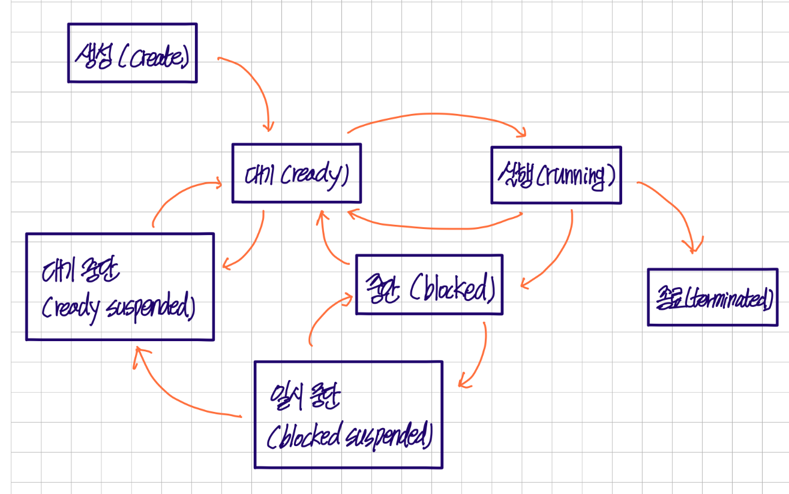

# Chapter3-3. 프로세스와 스레드

## 1) 프로세스
* 컴퓨터에서 실행되고 있는 프로그램, 프로그램이 메모리에 올라가 인스턴스화 된 것
* 스레드: 프로세스 내 작업의 흐름 
* 프로그램이 메모리에 올라가 프로세스화 (인스턴스화) → 운영체제의 CPU 스케줄러에 따라 실행

 

## 2) 컴파일 과정
* 컴파일러가 컴파일 과정을 통해 컴퓨터가 이해할 수 있는 기계어로 번역

#### ① 전처리
* 소스코드의 주석은 제거하고 헤더파일을 병합하여 매크로를 치환

#### ② 컴파일러
* 오류처리, 코드최적화 작업을 하며 어셈블리어로 변환

#### ③ 어셈블러
* 어셈블리어를 목적코드로 변환

#### ④ 링커
* 프로그램 내에 있는 라이브러리 함수, 다른 파일, 목적코드를 결합하여 실행파일 생성

#### ⑤ 라이브러리
1) 정적 라이브러리
   * 프로그램 빌드 시 라이브러리가 제공하는 모든 코드를 실행파일에 넣는 방식으로 라이브러리 사용
   * 장점: 외부 의존도🔻
   * 단점: 메모리 효율성🔻
   

2) 동적 라이브러리
   * 프로그램 실행 시 필요할 때만 DLL이라는 함수 정보를 통해 참조하여 라이브러리 사용
   * 장점: 메모리 효율성🔺
   * 단점: 외부 의존도🔺

 

## 3) 프로세스 상태

#### ① 생성 상태
* 프로세스가 생성된 상태, PCB 할당
1) `fork()`: 부모 프로세스의 주소공간을 그대로 복사하여 자식 프로세스를 생성
   * 주소 공간만 복사하고 부모 프로세스의 비동기 작업 등은 상속하지 않음
2) `exec()`: 프로세스 생성

#### ② 대기 상태
* 메모리 공간이 충분하면 메모리를 할당받고(실행상태) 아니면 대기상태
* 대기 상태란, CPU 스케줄러로부터 CPU 소유권이 넘어오도록 기다리는 상태

#### ③ 대기 중단 상태
* 메모리 부족으로 일시 중단된 상태

#### ④ 실행 상태
* CPU 소유권과 메모리를 할당받고 인스트럭션을 수행 중인 상태 (CPU burst)

#### ⑤ 중단 상태
* 어떤 이벤트가 발생한 후 기다리며 프로세스가 차단된 상태
* I/O 디바이스에 의한 인터럽트 현상으로 발생 가능

#### ⑥ 일시 중단 상태
* 중단된 상태에서 프로세스가 실행되려고 했으나 메모리 부족으로 일시 중단된 상태

#### ⑦ 종료 상태
* 메모리와 CPU 소유권을 모두 놓고 가는 상태
* 부모 프로세스가 자식 프로세스를 강제시키는 비자발적(abort) 포함

 

## 4) 프로세스의 메모리 구조
### 1️⃣ 동적 할당
* 런타임 단계에서 메모리를 할당

#### ① 스택 (stack)
* 지역변수, 매개변수, 실행되는 함수에 의해 늘어나거나 줄어드는 메모리 영역
* 함수가 호출될 때마다 호출될 때의 환경 등 정보가 저장
* 재귀함수 호출 시 새로운 스택 프레임이 매번 사용되기 떄문에 함수 내의 변수 집합이 해당 함수의 다른 인스턴스 변수를 방해하지 않음

#### ② 힙 (heap)
* 동적으로 할당되는 변수
* `malloc()`, `free()` 함수를 통해 관리할 수 있으며 동적으로 관리되는 자료 구조

### 2️⃣ 정적 할당
* 컴파일 단계에서 메모리를 할당

#### ① 데이터 영역 (BSS segment, Data segment)
1) BSS segment: 전역변수 또는 static, const로 선언되어 있고 0으로 초기화 또는 초기화가 어떠한 값으로 되어있지 않은 변수들이 할당
2) Data segment: 전역변수 또는 static, const로 선언되어 있고 0이 아닌 값으로 초기화된 변수가 할당

#### ② 코드 영역
* 프로그램 코드 들어감

 

## 5) PCB (Process Control Block, 프로세스 제어 블록)
* 운영체제에서 프로세스에 대한 메타데이터를 저장한 데이터
* 프로세스가 생성되면 운영체제는 해당 PCB 생성
* 프로그램이 실행되면 프로세스가 생성되고 프로세스 주소값들에 스택, 힙 등의 구조 기반으로 메모리 할당
* 이 프로세스의 메타데이터가 PCB에 저장 및 관리 (접근 문제로 커널 스택의 제일 앞부분에서 관리)

> ### 📢 메타데이터
> * 데이터에 관한 구조화된 데이터이자 테이터를 설명하는 작은 데이터, 대량의 정보 가운데서 찾고 있는 정보를 효율적으로 찾아내서 이용하기 위해 일정한 규칙에 따라 콘텐츠에 대해 부여되는 데이터

### 1️⃣ PCB 구조
* **프로세스 스케줄링 상태**: '준비', '일시중단'등 프로세스가 CPU에 대한 소유권을 얻은 이후의 상태
* **프로세스 ID**: 프로세스 ID, 해당 프로세스의 자식 프로세스 ID
* **프로세스 권한**: 컴퓨터 자원 또는 I/O 디바이스에 대한 권한 정보
* **프로그램 카운터**: 프로세스에서 실행해야할 다음 명령어의 주소에 대한 포인터
* **CPU 레지스터**: 프로세스를 실행하기 위해 저장해야 할 레지스터에 대한 정보
* **CPU 스케줄링 정보**: CPU 스케줄러에 의해 중단된 시간 등에 대한 정보
* **계정 정보**: 프로세스 실행에 사용된 CPU 사용량, 실행한 유저의 정보
* **I/O 상태 정보**: 프로세스에 할당된 I/O 디바이스 목록

 

### 2️⃣ 컨텍스트 스위칭
* PCB를 기반으로 프로세스의 상태를 저장하고 로드하는 과정
* 프로세스 할당 시간이 끝나거나 인터럽트에 의해 발생 (종료시 발생)
* 어떠한 시점에서 실행되고 있는 프로세스는 한개, 동시에 실행되는 것처럼 보이는 것은 컨텍스트 스위칭이 빠르게 실행되기 때문 (현재는 멀티코어 CPU를 가짐)
* 컨텍스트 스위칭 발생 시 유휴시간 발생
* **캐시미스**(비용): 컨텍스트 스위칭 발생 시 프로세스가 가지는 메모리 주소가 그대로 있으면 잘못된 주소변환이 생겨 캐시 클리어 → 캐시미스 발생
* **스레드에서 컨텍스트 스위칭**: 비용이 더 적고 시간도 더 적게 걸림 (스레드는 스택 영역을 제외한 모든 메모리를 공유)

 

## 6) 멀티 프로세싱
* 멀티 프로세스를 통해 두개 이상의 일을 수행할 수 있는 것
* 하나 이상의 일을 병렬처리
* A 프로세스 문제시 B 프로세스를 이용해서 처리 가능 (신뢰성)

### 1️⃣ 웹 브라우저
* 멀티 프로세스 구조
* 구조
  * **브라우저 프로세스**: 주소 표시줄, 북마크 막대, 뒤로 가기 버튼, 앞으로 가기 버튼 등을 담당하며 네트워크 요청이나 파일 접근 같은 권한
  * **렌더러 프로세스**: 웹 사이트가 보이는 부분의 모든 것을 제어
  * **플러그인 프로세스**: 웹 사이트에서 사용하는 플러그인을 제어
  * **GPU 프로세스**: GPU를 이용해서 화면을 그리는 부분을 제어

### 2️⃣ IPC (Inter Process Communication)
* 프로세스끼리 데이터를 주고받는 공유데이터를 관리하는 매커니즘
* 대표적인 예시는 클라이언트와 서버의 요청 및 응답

#### ① 공유 메모리
* 여러 프로세스에 동일한 메모리 블록에 대한 접근 권한이 부여되어 프로세스가 서로 통신할 수 있도록 공유 메모리를 생성하여 통신
* 기본적으로 각 프로세스의 메모리를 다른 프로세스가 접근할 수 없음
* 공유메모리를 통해 프로세스가 하나의 메모리를 공유
* 장점: 데이터를 주고 받는 것이 아닌 메모리 자체를 공유하기 때문에 불필요한 데이터 복사의 오버헤드가 발생하지 않음 (빠름)
* 단점: 같은 메모리 영역을 여러 프로세스가 공유하기 때문에 동기화 필요

#### ② 파일
* 디스크에 저장된 데이터 또는 파일서버에서 제공한 데이터 (프로세스간 통신)

#### ③ 소켓
* 동일한 컴퓨터의 다른 프로세스나 네트워크의 다른 컴퓨터로는 네트워크 인터페이스를 통해 전송하는 데이터 (TCP. UDP 등)

#### ④ 익명 파이프
* 프로세스 FIFO 방식으로 읽히는 파이프 기반으로 데이터를 주고 받음
* 단방향 방식이 읽기 전용, 쓰기 전용 파이프를 만들어 작동
* 부모 자식 프로세스간에만 사용 가능

#### ⑤ 명명된 파이프
* 파이프 서버와 하나 이상의 파이프 클라이언트 통신을 위한 명명된 단방향/양방향 파이프
* 클라이언트/서버 통신을 위한 별도 파이프 제공
* 여러 파이프 동시 사용 가능, 컴퓨터 프로세스끼리 다른 네트워크 상 컴퓨터랑도 통신 가능

#### ⑥ 메시지 큐
* 메시지를 큐 데이터 구조 형태로 관리하는 것
* 커널의 지역변수 형태 등 커널에서 전역적으로 관리
* 다른 IPC 방식에 비해 사용 방법 직관적
* 공유 메모리에서 동기화 복잡시 대안으로 메시지 큐 사용

 

## 7-1) 스레드
* 프로세스의 실행가능한 가장 작은 단위, 프로세스는 여러 스레드를 가질 수 있음
* 스레드는 코드, 데이터, 힙은 스레드끼리 서로 공유하나 그 외 영역은 각각 생성

## 7-2) 멀티스레딩
* 프로세스 내 작업을 여러 개의 스레드, 멀티 스레드로 처리하는 기법
* 장점: 스레드끼리 서로 자원을 공유하기 때문에 높은 효율성과 높은 동시성
* 단점: 한 스레드에 문제가 생기면 다른 스레드에 영향 → 프로세스 영향
* 예시: 웹 브라우저 - 렌더러 프로세스 (메인 스레드, 워커 스레드, 컴포지터 스레드, 레스터 스레드)

 

## 8-1) 공유 자원
* 시스템 안에서 각 프로세스, 스레드가 함께 접근할 수 있는 모니터, 프린터, 메모리, 파일, 데이터 등의 자원이나 변수
* **경쟁 상태**: 공유 자원을 두개 이상의 프로세스가 동시에 읽거나 쓰는 상황

## 8-2) 임계 영역
* 둘 이상의 프로세스, 스레드가 공유자원에 접근할 때 순서 등의 이유로 결과가 달라지는 코드 영역
* 해결방법 → 뮤텍스, 세마포어, 모니터 (조건: 상태배제, 한정대기, 융통성)

> ### 📢 상호 배제, 한정 대기, 융통성
> * **상호 배제** (mutual exclusion): 한 프로세스가 임계 영역에 들어갔을 때 다른 프로세스는 들어갈 수 없다.
> * **한정 대기** (bounded waiting): 특정 프로세스가 영원히 임계 영역에 들어가지 못하면 안 된다.
> * **융통성** (progress): 만약 어떠한 프로세스도 임계 영역을 사용하지 않는다면 임계 영역 외부의 어떠한 프로세스도 들어갈 수 있으며 이 때 프로세스끼리 서로 방해하지 않는다.

### 1️⃣ 뮤텍스
* 프로세스나 스레드가 공유자원을 `lock()`을 통해 잠금 설정을 하고 사용 후 `unlock()`을 통해 잠금을 해제하는 객체
* 잠금 / 잠금 해제 상태만 가짐

### 2️⃣ 세마포어
* 일반화된 뮤텍스, 간단한 정수값과 두가지 함수 wait(P 함수), signal(V 함수)로 공유자원 접근 처리
* `wait()`: 기다리는 함수
* `signal()`: 다음 프로세스로 순서를 넘겨주는 함수
* 공유 자원에 접근하면 `wait()` → 공유 자원을 해제하면 `signal()`
* 세마포어에는 조건변수가 없고 프로세스나 스레드가 세마포어 값을 수정할 때 다른 프로세스나 스레드는 동시에 프로세스 값 수정 불가
* **바이너리 세마포어**: 0과 1 두가지 값만 가지는 세마포어. 신호 매커니즘
* **카운팅 세마포어**: 여러 개의 값을 가지는 세마포어. 여러 자원에 대한 접근 제어

### 3️⃣ 모니터
* 둘 이상의 스레드나 프로세스가 공유자원에 안전하게 접근할 수 있도록 공유자원을 숨기고 해당 접근에 대해 인터페이스만 제공
* 모니터 큐를 통해 공유자원의 작업 순차적 처리
* 장점: 세마포어보다 구현 용이, 상호 배제 저동

## 9) 교착 상태
* 두 개 이상의 프로세스들이 서로가 가진 자원을 기다리며 중단된 상태
* 원인 
  1) **상호 배제**: 한 프로세스가 자원을 독점하고 있으며 다른 프로세스들은 접근이 불가능
  2) **점유 대기**: 특정 프로세스가 점유한 자원을 다른 프로세스가 요청하는 상태
  3) **비선점**: 다른 프로세스의 자원을 강제적으로 가져올 수 없음
  4) **환형 대기**: 프로세스 A는 프로세스 B의 자원을 요구하고, 프로세스 B는 프로세스 A의 자원을 요구하는 등 서로가 서로의 자원을 요구하는 자원
* 교착 상태의 해결 방법
  1) 자원을 할당할 때 애초에 조건이 성립되지 않도록 설계
  2) 교착 상태 가능성이 없을 때만 자원 할당되며, 프로세스당 요청 지원들의 최대치를 통해 자원 할당 가능 여부를 파악하는 '은행원 알고리즘' 사용
  3) 교착 상태가 발생하면 사이클이 있는지 찾아보고 이에 관련된 프로세스를 하나씩 지움
  4) 교착 상태는 매우 드물게 일어나기 때문에 이를 처리하는 비용이 더 커서 교착 상태가 발생하면 사용자가 작업을 종료 (현대 운영체제)

> ### 📢 은행원 알고리즘
> * 총 자원의 양과 현재 할당한 자원의 양을 기준으로 안정 또는 불안정 상태로 나누고 안정 상태로 가도록 자원을 할당하는 알고리즘
