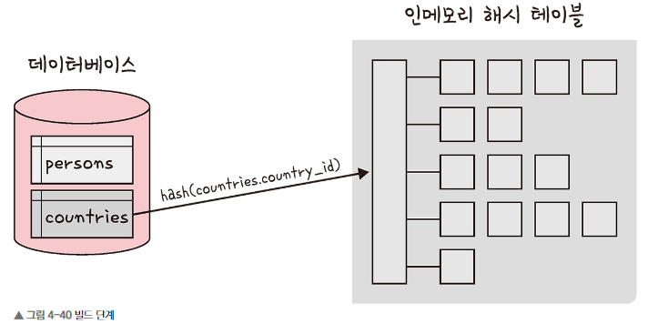
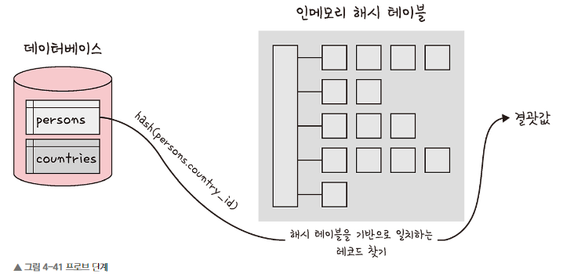

# Chapter4-7. 조인의 원리

## 1) 조인의 원리
* **중첩 루프 조인**, **정렬 병합 조인**, **해시 조인**

### 1️⃣ 중첩 루프 조인 (NLJ, Nested Loop Join)
* 중첩 for문과 같은 원리로 조건에 맞는 조인을 하는 방법
* 랜덤 접근에 대한 비용이 많이 증가하므로 대용량에서는 사용하지 않음
```text
for each row in t1 matching reference key {
    for each row in t2 matching reference key {
        if row satisfies join conditions, send to client
    }
}
// 첫번째 테이블에서 행을 한 번에 하나씩 읽고 그다음 테이블에서도 행을 하나씩 읽어 조건에 맞는 레코드를 찾아 결괏값 반환
```

* **블록 중첩 루프 조인 (BNL, Block Nested Loop)**: 조인할 테이블을 작은 블록으로 나워서 블록 하나씩 조인

<br>

### 2️⃣ 정렬 병합 조인
* 각각의 테이블을 조인할 필드 기준으로 정렬하고 정렬이 끝난 이후에 조인 작업을 수행하는 조인
* 조인할 때 쓸 적절한 인덱스가 없고 대용량의 테이블들을 조인하고 조인 조건으로 <, > 등 범위 비교 연산자가 있을 때 사용

<br>

### 3️⃣ 해시 조인
* 해시 테이블을 기반으로 조인하는 방법
* 두 개의 테이블을 조인한다고 했을 때 하나의 테이블이 메모리에 온전히 들어간다면 보통 중첩 루프 조인보다 더 효율
* 동등 조인에서만 사용 가능
* MySQL의 해시 조인 단계는 **빌드 단계**, **브로브 단계**로 나뉨

#### ① 빌드 단계
* 입력 테이블 중 하나를 기반으로 메모리 내 해시 테이블을 빌드하는 단계
* 더 작은 테이블을 기반으로 해서 테이블을 빌드
* 조인에 사용되는 필드가 해시 테이블의 키로 사용됨


#### ② 프로브 단계
* 프로브 단계 동안 레코드 읽기를 시작, 각 레코드에 대해 id에 일치하는 레코드를 찾아서 결괏값으로 반환
* 각 테이블을 한 번씩만 읽어 중첩해서 두 개의 테이블을 읽는 중첩 루프 보다 성능이 좋음
