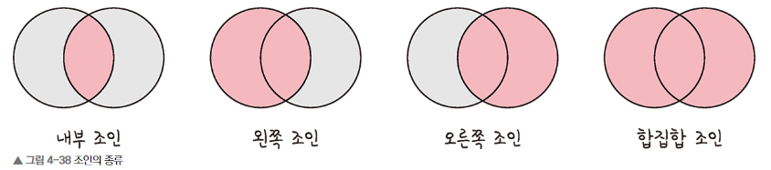

# Chapter4-6. 조인의 종류

## 1) 조인
* **조인**: 하나의 테이블이 아닌 두 개 이상의 테이블을 묶어서 하나의 결과물을 만드는 것
* MySQL - JOIN, MongoDB - lookup(성능 저하로 권장하지 않음)

### 1️⃣ 조인의 종류

1) **내부 조인(inner join)**: 왼쪽 테이블과 오른쪽 테이블의 두 행이 모두 일치하는 행이 있는 부분만 표기
   * 두 테이블 간의 교집합
   * `INNER JOIN`
2) **왼쪽 조인(left outer join)**: 왼쪽 테이블의 모든 행이 결과 테이블에 표기
   * 테이블 B의 일치하는 부분의 레코드와 함꼐 테이블 A를 기준으로 완전한 레코드 집합을 생성함
   * 테이블 B에 일치하는 항목이 없으면 null
   * `LEFT JOIN`
3) **오른쪽 조인(right outer join)**: 오른쪽 테이블의 모든 행이 결과 테이블에 표기
   * 테이블 A의 일치하는 부분의 레코드와 함꼐 테이블 B를 기준으로 완전한 레코드 집합을 생성함
   * 테이블 A에 일치하는 항목이 없으면 null
   * `RIGHT JOIN`
4) **합집합 조인(full outer join)**: 두 개의 테이블을 기반으로 조인 조건에 만족하지 않는 행까지 모두 표기
   * 양쪽 테이블에서 일치하는 레코드와 함께 테이블 A와 B의 모든 레코드 집합을 생성
   * 일치하는 항목이 없으면 누락된 쪽에 null 값이 포함되어 출력
   * `FULL OUTER`

