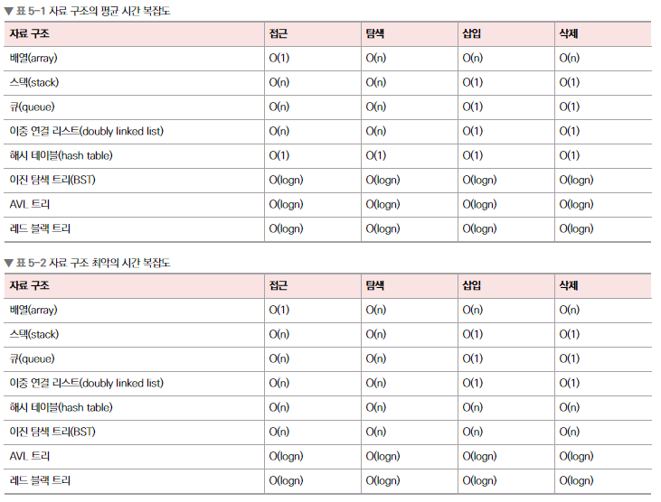

# Chapter5-1. 복잡도

## 1) 자료 구조
* **자료 구조**: 효율적으로 데이터를 관리하고 수정, 삭제, 탐색, 저장할 수 있는 데이터 집합
* 복잡도는 시간 복잡도와 공간 복잡도로 나뉜다.

> ### 📢 STL
> * C++의 표준 템플릿 라이브러리이자 스택, 배열 등 데이터 구조의 함수 등을 제공하는 라이브러리의 묶음

 

## 2) 복잡도
### 1️⃣ 시간복잡도
* **시간 복잡도**: 입력 크기에 대해 어떠한 알고리즘이 실행되는 데 걸리는 시간
* 주요 로직의 반복 횟수를 중점으로 측정
* 효율적인 코드로 개선하는 데 쓰이는 척도
* **빅오 표기법**: 입력 범위 n을 기준으로 해서 로직이 몇 번 반복되는지 나타내는 것
  * 10n^2 + n = O(n^2)

* 지향: O(n^2) < O(n) < O(1)

 

### 2️⃣ 공간 복잡도
* **공간 복잡도**: 프로그램을 실행시켰을 때 필요로 하는 자원 공간의 양. 정적 변수, 동적으로 재귀적인 함수로 인해 공간을 계속 필요로 할 경우 포함

 

## 3) 자료 구조에서의 시간 복잡도
* 평균 시간 복잡도와 최악의 시간 복잡도를 고려하면서 사용

