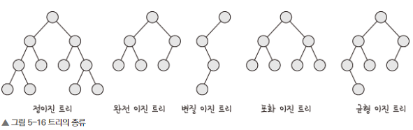
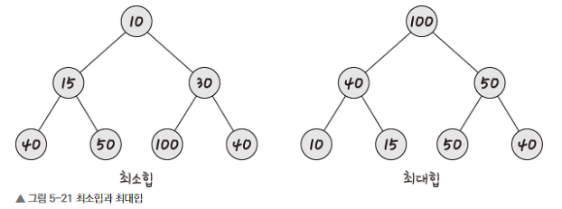

# Chapter5-3. 비선형 자료 구조
* 비선형 자료 구조: 일렬로 나열하지 않고 자료 순서나 관계가 복잡한 구조

## 1) 그래프
* **그래프**: 정점과 간선으로 이루어진 자료 구조
  * **정점(vertex)**: 어떠한 곳으로 무언가를 통해 간다고 했을 때 '어떠한 곳'
  * **간선(edge)**: 어떠한 곳으로 무언가를 통해 간다고 했을 때 '무언가'
    * `단방향 간선`, `양방향 간선`
    * `outdegree`: 정점으로 나가는 간선
    * `indegree`: 정점으로 들어오는 간선
    * `U에서부터 V로 간다`
  * **가중치**: 간선과 정점 사이에 드는 비용

 

## 2) 트리
* **트리**: 정점과 간선으로 이루어져 있고, 트리 구조로 배열된 계층적 데이터의 집합
* 숲: 트리로 이루어진 집합
* 두 노드 사이의 경로를 유일무이 함
* `루트 노드`, `내부 노드`, `리프 노드`
    * `루트 노드`: 가장 위에 있는 노드.
    * `내부 노드`: 루트 노드와 리프 노드 사이에 있는 노드
    * `리프 노드`: 자식 노드가 없는 노드
* `트리의 높이와 레벨`
    * `깊이`: 트리에서의 깊이는 각 노드마다 다르며, 루트 노드부터 특정 노드까지 최단 거리로 갔을 때의 거리
    * `높이`: 트리의 높이는 루트 노드부터 리프 노드까지 거리 중 가장 긴 거리
    * `레벨`: 보통 깊이와 같은 의미
    * `서브 트리`: 트리 내의 하위 집합, 트리 내의 부분 집합

 

### 1️⃣ 이진 트리
* **이진 트리**: 자식의 노드 수가 두 개 이하인 트리

* **정이진 트리(full binary tree)**: 자식 노드가 0 또는 두 개인 이진 트리
* **완전 이진 트리(complete binary tree)**: 왼쪽에서부터 채워져 있는 이진 트리. 마지막 레벨을 제외하고 모든 레벨이 완전히 채워져있음
* **변질 이진 트리(degenerate binary tree)**: 자식 노드가 하나밖에 없는 이진 트리
* **포화 이진 트리(perfect binary tree)**: 모든 노드가 꽉 차 있는 이진 트리
* **균형 이진 트리(balanced binary tree)**: 왼쪽과 오른쪽 노드의 높이 차이가 1 이하인 이진 트리. 레드 블랙 트리가 해당됨

 

### 2️⃣ 이진 탐색 트리
* **이진 탐색 트리(BST)**: 노드의 오른쪽 하위 트리에는 '노드 값보다 큰 값'이 있는 노드만 포함되고, 왼쪽 하위 트리에는 '노드 값 보다 작은 값'이 들어 있는 트리
* 검색 용이
* 검색 시간 복잡도: `O(logn)`, `O(n)`

 

### 3️⃣ AVL 트리
* **AVL 트리(Adelson-Velsky and Landis tree)**: 최악의 경우 선형적인 트리가 되는 것을 방지하고 스스로 균형을 잡는 이진 탐색 트리
    * 두 자식 서브트리의 높이는 항상 최대 1만큼 차이가 남
* 탐색, 삽입, 삭제 시간 복잡도: `O(logn)`
* 삭제 할 때마다 균형이 안 맞는 것을 마추기 위해 트리 일부를 회전시키며 균형을 잡음

 

### 4️⃣ 레드 블랙 트리
* **레드 블랙 트리**: 균형 이진 탐색 트리. 각 노드는 빨간색 또는 검은색의 색상을 나타내는 추가 비트를 저장하며, 삽입 및 삭제 중에 트리가 균형을 유지하도록 하는데 사용
* 탐색, 삽입, 삭제 시간 복잡도: `O(logn)`
* `set`, `multiset`, `map`. `multimap`
* 모든 리프 노드와 루트 노드는 블랙이고 어떤 노드가 레드이면 그 노드의 자식은 반드시 블랙

 

## 3) 힙

* **힙**: 완전 이진 트리 기반의 자료 구조. 최소힙과 최대힙 두가지가 있고 해당 힙에 따라 특정한 특징을 가진 트리
  * **최대힙**: 루트 노드에 있는 키는 모든 자식에 있는 키 중에서 가장 커야 한다. 또한, 각 노드의 자식 노드와의 관계도 이와 같은 특징이 재귀적으로 이루어져야 함
  * **최소힙**: 최소힙에서 루트 노드에 있는 키는 모든 자식에 있는 키 중에서 최솟값이 어야 한다. 또한, 각 노드의 자식 노드와의 관계도 이와 같은 특징이 재귀적으로 이루어져야 함
* 최대힙에 새로운 요소가 들어오면, 새로운 노드를 마지막 노드에 삽입한 뒤 크기를 비교하며 노드를 교환
* 최대힙에서 최대값(루트 노드)가 삭제되면, 마지막 노드와 루트 노드를 스왑하는 과정을 거쳐 힙이 재구성됨

 

## 4) 우선순위 큐
* **우선순위 큐**: 우선순위 대기열, 대기열에서 우선 순위가 높은 요소가 우선순위가 낮은 요소보다 먼저 제공되는 구조
* 우선순위 큐는 힙을 기반으로 구현

 

## 5) 맵
* **맵**: 특정 순서에 따라 키와 매핑된 값의 조합으로 형성된 자료구조
* 레드 블랙 트리 자료구조를 기반으로 형성되고, 삽입하면 자동으로 정렬

 

## 6) 셋
* **셋**: 특정 순서에 따라 고유한 요소를 저장하는 컨테이너. 중복되는 요소가 없고 유니크한 값만 저장하는 자료구조

 

## 7) 해시 테이블
* **해시 테이블**: 무한에 가까운 데이터들을 유한한 개수의 해시 값으로 매핑한 테이블
* 삽입, 삭제, 탐색 평균 시간 복잡도: `O(1)`