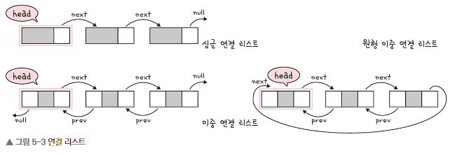

# Chapter5-2. 선형 자료 구조
* 선형 자료 구조: 요소가 일열로 나열되어 있는 자료 구조

## 1) 연결 리스트
* **연결 리스트**: 데이터를 감싼 노드를 포인터로 연결해서 공간적인 효율성을 극대화 시킨 자료구조
* 삽입, 삭제 시간 복잡도: `O(1)`
* 탐색 시간 복잡도: `O(n)`
* `prev` 포인터와 `next` 포인터로 앞과 뒤의 노드를 연결
* 종류: **싱글 연결 리스트**, **이중 연결 리스트**, **원형 이중 연결 리스트**

 

## 2) 배열
* **배열**: 같은 타입의 변수들로 이루어져 있고, **크기가 정해져 있으며**, 인접한 메모리 위치에 있는 데이터를 모아놓은 집합
* **중복 허용**, **순서 보장**
* 접근 시간 복잡도: `O(1)`, 랜덤 접근 가능
* 삽입, 삭제 시간 복잡도: `O(n)`

> ### 📢 연결 리스트와 배열
> * 데이터 추가와 삭제를 많이 하는 것은 연결 리스트 (랜덤접근 불가능)
> * 접근(참조)를 많이 하는 것은 배열로 하는 것이 유리 (랜덤접근 가능)

 

### 1️⃣ 랜덤 접근과 순차적 접근
* **랜덤 접근(직접 접근)**: 동일한 시간에 배열과 같은 순차적인 데이터가 있을 때 임의의 인덱스에 해당하는 데이터에 접근할 수 있는 기능
* **순차적 접근**: 데이터를 저장된 순서대로 검색

 

## 3) 벡터
* **벡터(vector)**: 동적으로 요소를 할당할 수 있는 동적 배열.
* 컴파일 시점에 개수를 모른다면 벡터를 사용
* **중복 허용**, **순서 보장**, **랜덤 접근 가능**
* 탐색, 뒤의 요소 삽입 및 삭제 시간 복잡도: `O(1)`
* 중간 요소 삽입 및 삭제 시간 복잡도: `O(n)`

* `push_back()`을 하면 크기가 매번 증가하는 것이 아닌, 2의 제곱승 + 1마다 크기를 2배 늘림
  * n번 `push_back()`을 할 때, 드는 비용은 `T(n) = 3n - 1`
  * 평균적으로 드는 비용은 3
  * `push_back()`의 시간 복잡도는 `O(1)`

 

## 4) 스택
* **스택**: 가장 마지막으로 들어간 데이터가 가장 첫번째로 나오는 자료 구조(LIFO)
* 재귀적인 함수, 알고리즘에 사용, 웹 브라우저 방문 기록 등에 사용
* 삽입 및 삭제 시간 복잡도: `O(1)`
* 탐색 시간 복잡도: `O(n)`

 

## 5) 큐
* **큐**: 먼저 집어넣은 데이터가 먼저 나오는 성질을 가지는 자료 구조(FIFO)
* CPU 작업을 기다리는 프로세스, 스레드 행렬, 네트워크 접속을 기다리는 행렬, 너비 우선 탐색, 캐시 등에 사용
* 삽입 및 삭제 시간 복잡도: `O(1)`
* 탐색 시간 복잡도: `O(n)`
